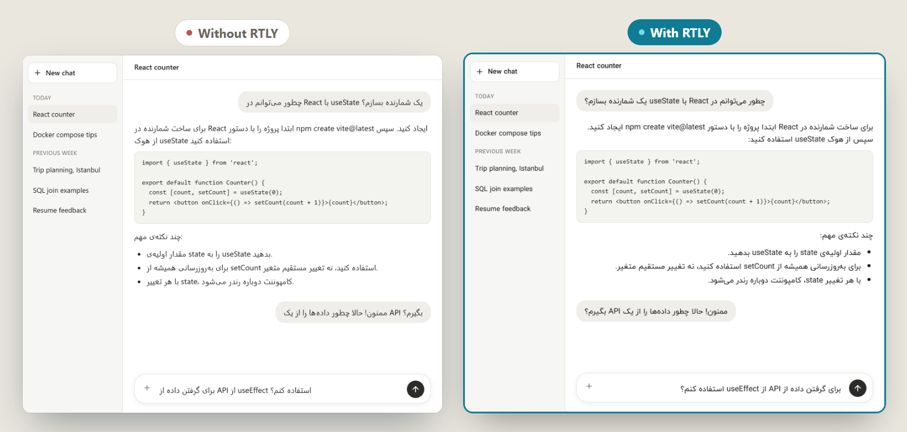
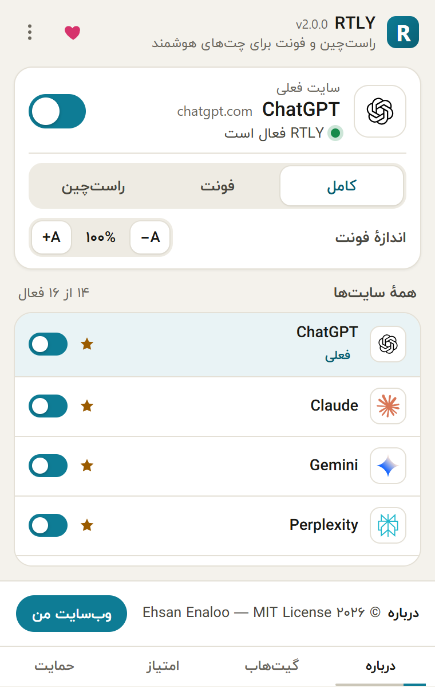
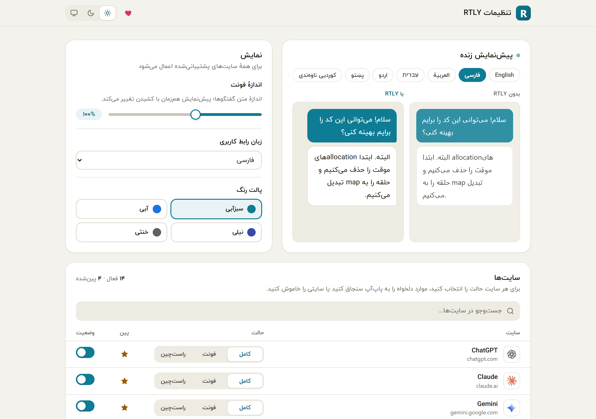

**English** · [فارسی](docs/translations/README.fa.md) · [العربية](docs/translations/README.ar.md)

# RTLY

**Right-to-left text and a Persian font for AI chat sites.**

A free, open-source browser extension for people who write in Persian, Arabic, Hebrew, Urdu and other right-to-left languages. 
It runs in your browser only. No account, no tracking, no server.

[Features](#features) · [Supported sites](#supported-sites) · [Install](#install) · [Privacy](#privacy) · [Documentation](#documentation) · [FAQ](#faq) · [Contributing](#contributing)

<picture>
  <source media="(prefers-color-scheme: dark)" srcset="docs/assets/screenshots/before-after-dark.png">
  
</picture>

## What is RTLY?

Most AI chat sites are built for left-to-right text. When you write or read Persian, Arabic or Hebrew, the lines sit on the wrong side, punctuation lands in the wrong place, mixed English and Persian sentences get scrambled, and the default font is often poor for Arabic script.

RTLY fixes this on the page itself. For each message it looks at the text, and if the text is mostly right-to-left script it sets the direction to right-to-left and applies the bundled IranYekan font. English messages stay left-to-right and keep the site's font. RTLY avoids code blocks, icons, menus and sidebars.

## Features

| | |
| --- | --- |
| **Automatic direction**   Direction is chosen per message from the characters in it. Persian, Arabic, Hebrew, Urdu and other right-to-left scripts are detected. Mixed text follows the dominant language. | **IranYekan font**   The font is bundled in the extension. It is applied only to text that contains Arabic-script characters, so English text keeps the site's own font. |
| **Three modes per site**   *Full* (font and direction), *Font* only, or *RTL* only. Changing the mode applies to open tabs without a reload. | **On or off per site**   Switch any of the 16 supported sites off from the popup, the settings page, the right-click menu or the keyboard shortcut `Alt+Shift+R`. |
| **Font size**   Scale chat text from 85% to 120% in steps of 5. | **Private by design**   No network requests, no analytics, no remote code. Settings stay in your browser's extension storage. |
| **Light and dark, four colors**   The popup and settings page follow your system theme or your choice, with teal, blue, indigo or neutral accents. | **15 interface languages**   English, Persian, Arabic, Hebrew, Urdu and ten more right-to-left languages. Some strings are still English in some languages (see [Translations](#translations)). |

  
  &nbsp;&nbsp;
  

## Supported sites

RTLY runs only on these sites. It does nothing anywhere else.

| Site | Address | Notes |
| --- | --- | --- |
| ChatGPT | chatgpt.com | The older chat.openai.com address is also covered. |
| Claude | claude.ai | |
| Gemini | gemini.google.com | |
| Perplexity | perplexity.ai | |
| Microsoft Copilot | copilot.microsoft.com | |
| Google AI Studio | aistudio.google.com | |
| NotebookLM | notebooklm.google.com | |
| Grok | grok.com | |
| Poe | poe.com | |
| Z.ai | z.ai, chat.z.ai | |
| DeepSeek | chat.deepseek.com | |
| Qwen | qwen.ai, chat.qwen.ai | |
| Bing | bing.com | Runs on all of bing.com, not only the chat. |
| Mistral | mistral.ai, chat.mistral.ai | Runs on the whole host. |
| Hugging Face | huggingface.co/chat | Only the `/chat` section. |
| Cohere | cohere.com, coral.cohere.com | Runs on the whole host. |

Sites change their page markup without notice. When that happens RTLY can stop working on that site until its selectors are updated. If a site looks wrong, please [report it](https://github.com/ehsanenaloo/RTLY/issues/new?template=broken_site.yml).

## Install

| Browser | Status | How |
| --- | --- | --- |
| **Chrome** (111 or newer) | Tested | [Chrome Web Store](https://chromewebstore.google.com/detail/hhifipkafndnildgldggiohfkbpikmkd) |
| **Microsoft Edge** | Same package as Chrome | Install from the Chrome Web Store page, or unzip the Chrome zip from [Releases](https://github.com/ehsanenaloo/RTLY/releases) and load it unpacked. |
| **Firefox 128+** (desktop) | Experimental | [Temporary install from the Releases page](#firefox-experimental) |
| **Safari** | Not supported | |

**Chrome and Edge:** open the store page, click **Add to Chrome**, then click the puzzle icon in the toolbar and pin RTLY. Tabs that were already open before you installed need a reload.

**Firefox (experimental):** RTLY is not on Firefox Add-ons.

1. Download `rtly-<version>-firefox.zip` from the [Releases page](https://github.com/ehsanenaloo/RTLY/releases).
2. In Firefox, open `about:debugging#/runtime/this-firefox`.
3. Click **Load Temporary Add-on** and choose the zip file.

Firefox removes temporary add-ons when it closes, so you repeat these steps after a restart. The Firefox package passes `web-ext lint`, but it has not been run in a real Firefox by the test suite in this repository.

**From source:** there is no build step. The `extension/` folder is the extension. Open `chrome://extensions`, turn on **Developer mode**, click **Load unpacked** and choose the `extension` folder.

## How to use it

1. Open one of the [supported sites](#supported-sites). RTLY is on by default.
2. Click the RTLY toolbar icon to see the current site, the on/off switch, the mode and the font size.
3. Open the settings (the three-dot menu in the popup, then **Settings**) for the live preview, the language and color options, and the full sites table.

The [user guide](https://ehsanenaloo.github.io/RTLY/) covers every control, with screenshots.

## Privacy

- There is no server, no account, no analytics and no ads. RTLY makes no network requests of its own.
- Settings (on/off per site, modes, font size, theme, language) are saved in the browser's extension storage on your device.
- RTLY needs permission to read and change the pages of the sites listed above, because it sets direction and font on the text there. It reads the text only to decide its direction and never sends it anywhere.
- It requests two extension permissions, `storage` and `contextMenus`, plus access to the sites listed above. It does not request the tabs, history, cookies or downloads permissions.
- Links in the popup and settings (GitHub, Buy me a coffee, the store page) open in a new tab only when you click them.

Read the [privacy policy](docs/PRIVACY.md) for details.

## Documentation

| | |
| --- | --- |
| [User guide](https://ehsanenaloo.github.io/RTLY/) | Every feature, with screenshots |
| [Known limits](https://ehsanenaloo.github.io/RTLY/guides/limits.html) | What does not work or is untested |
| [Privacy policy](docs/PRIVACY.md) | What the extension stores and what it can access |
| [Changelog](CHANGELOG.md) | What changed in each release |
| [Contributing](.github/CONTRIBUTING.md) | How to report bugs, add a site and send changes |
| [Support](.github/SUPPORT.md) | Where to ask for help |
| [Security](.github/SECURITY.md) | How to report a security problem in private |

## FAQ

<b>Does RTLY read or send my chats?</b>

RTLY reads the text on the page to decide whether a message is right-to-left. It does this inside your browser and sends nothing. It has no server to send to and makes no network requests.

<b>Why is some text still left-aligned?</b>

Direction is chosen per block from its characters. A block that is mostly English stays left-to-right on purpose. Code blocks, menus, sidebars and icons are left alone. If a Persian message is wrong, the site may have changed its markup. [Report it](https://github.com/ehsanenaloo/RTLY/issues/new?template=broken_site.yml).

<b>Does it change the font of English text?</b>

No. The IranYekan font is applied only to elements whose text contains Arabic-script characters. If you only want the font or only the direction, choose the **Font** or **RTL** mode for that site.

<b>How do I turn it off for one site?</b>

Use the switch in the popup, the right-click menu item **RTLY: Enable/disable for this site**, or `Alt+Shift+R`. Turning a site on or off reloads that site's open tabs.

<b>Does it work on other AI sites?</b>

Only on the sites in the table above. Adding a site means adding its page selectors and a host permission. See [Contributing](.github/CONTRIBUTING.md#adding-a-site), or ask in a [feature request](https://github.com/ehsanenaloo/RTLY/issues/new?template=feature_request.yml).

<b>How do I report a problem?</b>

[Open an issue](https://github.com/ehsanenaloo/RTLY/issues). Include the page address, a screenshot with private text hidden, your browser and the RTLY version. For security problems, see [SECURITY.md](.github/SECURITY.md).

## Translations

The popup and settings page are available in 15 languages: English, Persian, Arabic, Hebrew, Urdu, Pashto, Central Kurdish, Sindhi, Uyghur, Yiddish, Western Punjabi, South Azerbaijani, Saraiki, Balochi and Kashmiri.

These translations are not all reviewed by native speakers. In ten of the languages (Pashto, Central Kurdish, Sindhi, Uyghur, Yiddish, Western Punjabi, South Azerbaijani, Saraiki, Balochi, Kashmiri) eight strings (mostly on the settings page) are still in English. The extension name, description and shortcut label (the part the browser shows in its own menus) are translated for 10 of the 15 languages; the other five show English there.

If you speak one of these languages and can improve a translation, please use the [translation fix form](https://github.com/ehsanenaloo/RTLY/issues/new?template=translation_fix.yml) or send a pull request. See [CONTRIBUTING.md](.github/CONTRIBUTING.md#translations).

This README is also available in [Persian](docs/translations/README.fa.md) and [Arabic](docs/translations/README.ar.md).

## Contributing

Bug reports, broken-site reports, translation fixes and small pull requests are welcome. Read [CONTRIBUTING.md](.github/CONTRIBUTING.md) first.

If RTLY saves you time, you can [buy me a coffee](https://buymeacoffee.com/enaloo). A rating on the [Chrome Web Store](https://chromewebstore.google.com/detail/hhifipkafndnildgldggiohfkbpikmkd/reviews) also helps other people find it.

## License

[MIT](LICENSE). Copyright 2026 Ehsan Enaloo.

The MIT license covers the code in this repository. The bundled IranYekan font files in `extension/fonts/` and the site logos in `extension/logos/` are third-party material and keep their own terms.
